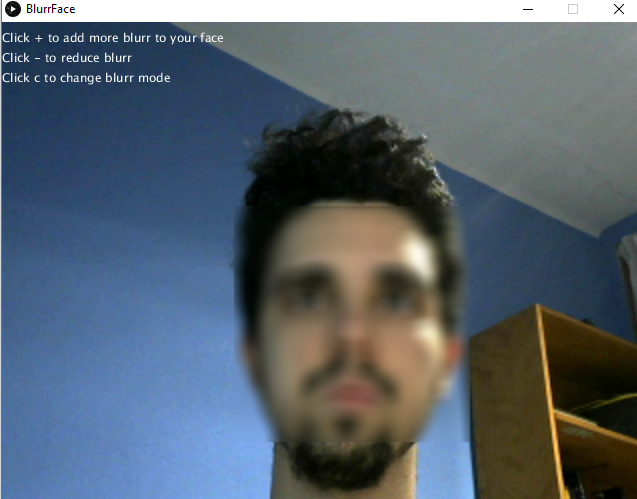

# Datos
Autor: Fernando Marcelo Alonso

Asignatura: Creando Interfaces de Usuario(CIU)

## Introducción
Esta práctica consiste en la creación de una interacción con la cámara.

## Implementación y argumentación

Para la implementación he usado Processing 3.5.4.

**Vista:** Solo hay  una vista desde la que se ve la cámara del usuario.

**Pixelado:** Para la realización del pixelado me he ayudado de opencv para detectar la cara, el pixelado se realiza cogiendo una malla de pixeles alrededor de cada pixel e interpolando el valor del mismo, es decir la vecindad de pixeles de cada pixel afecta a su valor con lo que nos encontramos que cuanto mayor sea la vecindad que escojamos mayor será el pixelado.

**Modos de pixelado:** Hay dos modos de pixelados, el básico que pixela la cara completa y uno alternativo que solo pixela la zona de los ojos como se realiza a veces intentando protejer la identidad de las personas. Para el pixelado que solo pixela las zonas de los ojos tuve que acotar la zona de la cara para que encajará más o menos con los ojos y pixelar dicha zona. Obviamente se puede cambiar con la tecla c entre dichos modos de pixelado, se indica como hacerlo en un texto arriba a la izquierda en la interfaz.

**Mayor o menor pixelado:** Podemos aumentar o disminuir el pixelado a gusto con las teclas + y -, opte por esta opción pues me parece interesante que cada uno lo pueda ajustar en función de lo que le parezca suficiente, por ejemplo tendremos más cuidados con individuos más vulnerables como pueden ser los niñós. Al aumentar o disminuir el pixelado estamos alterando el número de pixeles que cogemos para interpolar un pixel, cuanto más pixeles cojamos sera mayor será lo pixelado que se encuntre.

## GIF

